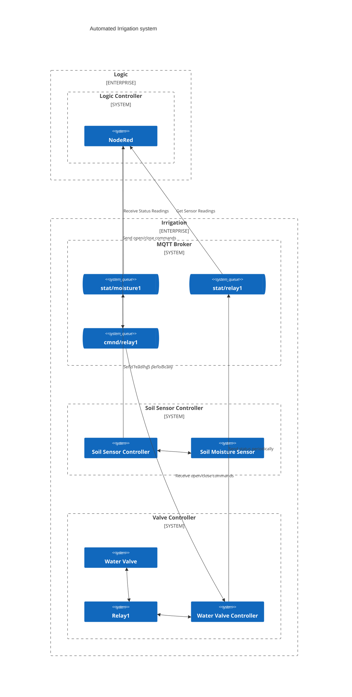

# Automated Irrigation system
Homebrew automated Irrigation system based on ESP32

Bill of materials:
* ESP32 based controllers (AZ-Delivery ESP32 DevKitC V2 ESP32-WROOM-32)
* Capacitive Soil Moisture Sensor v 1.2 (AZ-Delivery)
* KF-301 Relay Module with Low-level Trigger (AZ-Delivery)
To be continued...

